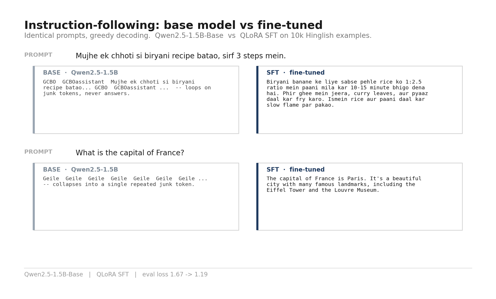
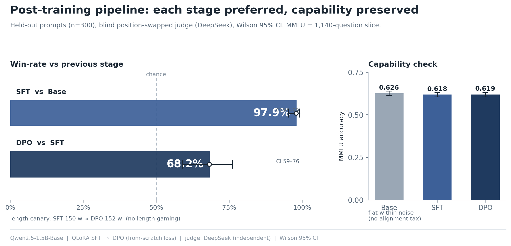
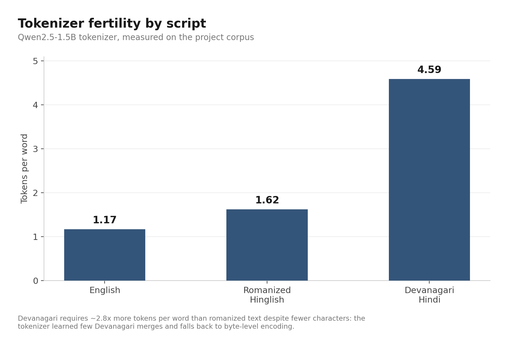

# Khichdi — a Hindi–English (Hinglish) assistant, post-trained from a base model

Turning **Qwen2.5-1.5B-Base** into a code-switched **Hinglish** assistant with a full
post-training pipeline — synthetic data → curation → SFT → DPO — built end-to-end on
rented GPUs for a few dollars.

- **SFT model:** https://huggingface.co/sarthaksenapati/qwen1.5b-hinglish-sft-v2
- **DPO model (aligned):** https://huggingface.co/sarthaksenapati/qwen1.5b-hinglish-dpo
- **Datasets:** [10k SFT](https://huggingface.co/datasets/sarthaksenapati/khichdi-sft) · [preference pairs](https://huggingface.co/datasets/sarthaksenapati/khichdi-pref)
- **Writeups:** [Part 1 — SFT](https://sarthak-senapati.hashnode.dev/teaching-a-base-model-to-speak-hinglish-part-1-sft) · [Part 2 — DPO](https://sarthak-senapati.hashnode.dev/teaching-a-base-model-to-speak-hinglish-part-2-preference-optimization-with-dpo-from-scratch)

---

## What this is

A base language model is a document-completer — it has knowledge but no instruction-following.
This project does the **post-training** that turns it into an assistant, in a deliberately hard
domain: **romanized Hindi–English code-switching** (how hundreds of millions of people actually
type), which most models and tokenizers handle poorly.

Started from the **Base** model on purpose (not Instruct) so the behavior change is entirely
attributable to this pipeline.

## Result: base → SFT

Same prompts, greedy decoding. The base model loops/completes documents; the SFT model answers
in Hinglish and follows instructions.



Validation `eval_loss` **1.67 → 1.19** (QLoRA, 2 epochs). Judged blind by an independent model,
**SFT beats base 97.9%** of the time (95% CI 95.2–99.1%) on 300 held-out prompts, with **MMLU flat**
(0.626 → 0.618) — capability preserved.

## Result: SFT → DPO

On-policy preference data (rank the SFT model's own samples) + a **from-scratch DPO loss** — verified
against TRL's formula and analytic invariants (the loss starts at exactly log 2). The aligned model
is preferred **68.2%** over SFT (95% CI 59–76%), with **no capability loss** (MMLU 0.619) and **no
length inflation** — the win isn't from longer answers.



## A finding that shaped the project

Tokenizer fertility on the project corpus — Devanagari costs ~2.8× more tokens per word than
romanized text *despite fewer characters*, because the tokenizer learned few Devanagari merges
and falls back to byte-level encoding. This is why the dataset is **romanized-primary**.



## How it's built

```
Qwen2.5-1.5B-Base
      │
      ├─ tokenizer forensics ──────────► romanized-primary decision
      ├─ data spec (taxonomy/mix/splits, decided before collecting)
      ├─ synthetic generation (Self-Instruct style, Llama-3.3-70B)
      ├─ cleaning + language-ID relabeling + LLM-judge scoring (1–10)
      ├─ MinHash near-dedup  ──────────► 10k curated set (80/12/8)
      ├─ QLoRA SFT (manual chat templating + loss masking)
      ├─ on-policy preference data (sample SFT, judge-rank chosen/rejected)
      ├─ DPO (loss from scratch, verified vs TRL + analytic invariants)
      └─ evaluation: win-rate (blind judge, Wilson CI) + MMLU slice
```

**Engineering decisions worth a look** (details in `reports/` and the blog):
- **Function-word language-ID** for romanized Hindi (off-the-shelf language-ID fails on it).
- **LLM-as-judge is lenient by default** — a 1–5 rubric scored 99% of rows a perfect 5; a harsh
  1–10 rubric that forced the judge to name a flaw first produced real tiers.
- **Manual audit caught what the metric missed** — the judge's correctness score waved through
  pseudoscientific health claims; reading 100 rows by hand caught it.
- **Manual loss masking** (plain `transformers` Trainer, not `SFTTrainer`) — verified before
  training that loss falls only on assistant tokens + the stop token.
- **DPO loss from scratch** — ~10 lines, verified against TRL's formula (1e-6) and analytic
  invariants (loss = log 2 at init, correct gradient signs); the live first training step hit 0.6931.
- **Found the over-optimization boundary** — a stronger DPO run (3 epochs) improved the win-rate
  while MMLU and answer length stayed flat, confirming the gain wasn't bought with capability or verbosity.

## Repo layout

```
configs/        one YAML per experiment
src/data/       data pipeline: generate, clean, score, dedup, filter, pref sampling + judging
src/dpo/        DPO loss + sequence log-probs (from scratch)
src/eval/       win-rate harness (blind judge, position-swap, Wilson CI)
scripts/        runnable entry points (tokenizer report, probes, verify_dpo_loss, ...)
reports/        data spec, lab notes (15 days), content drafts
assets/         figures
train_sft.py        QLoRA SFT (runs on the pod)
train_dpo.py        DPO training with the from-scratch loss
eval_generate*.py   held-out completions (base/SFT and SFT/DPO)
generate.py         base-vs-SFT comparison
```

## Reproduce (high level)

```bash
pip install -r requirements.txt
# data pipeline (needs OPENROUTER_API_KEY)
python -m src.data.gen_instructions --cells 900
python -m src.data.gen_responses
python -m src.data.clean --in data/raw/*.jsonl --out data/clean/sft_clean.jsonl
python -m src.data.score
python -m src.data.dedup
python -m src.data.filter --in data/clean/sft_pool_dedup.jsonl
# SFT (GPU): see train_sft.py
# preference data (GPU sample + API judge)
python -m src.data.gen_pref_samples --n 4 --push-repo <user>/khichdi-pref
python -m src.data.judge_pref --in data/pref/pref_samples.jsonl --out data/pref/pref_pairs.jsonl
# DPO (GPU) + verify the loss
python scripts/verify_dpo_loss.py
python train_dpo.py --epochs 3 --lr 1e-5 --beta 0.1
# evaluate (DPO vs SFT)
python -m src.eval.win_rate --in data/eval/dpo_vs_sft.jsonl --a-name sft --b-name dpo
```

## Status & roadmap

*Day 15 of a 21-day build.*

- [x] Data pipeline + SFT
- [x] Evaluation harness — win-rate (Wilson CI) + MMLU slice
- [x] Preference data + **DPO** — loss from scratch, verified vs TRL
- [ ] IPO / KTO comparison against the DPO baseline
- [ ] Final analysis, figures, and writeup

## Limitations

Not safety-aligned; low-stakes Hinglish use only. DPO reduced but did not fully fix the verbosity /
clean-stopping issue, Devanagari output is weak, and the model can repeat dubious claims from its
synthetic training data. See the model cards for details.

## Cost

~$8 total (OpenRouter generation + judging + rented RTX 4090 GPU time across SFT and DPO).

## License

Apache-2.0 (adapters). Base model Qwen2.5-1.5B is Apache-2.0.
